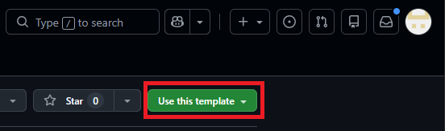
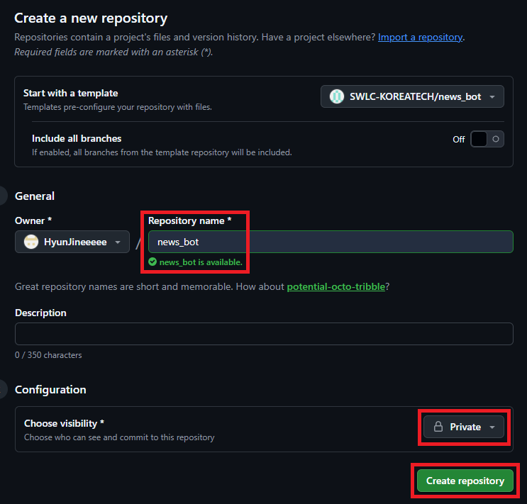
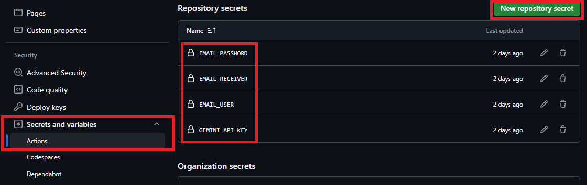
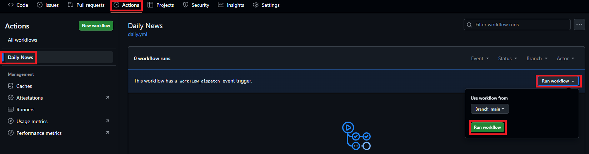
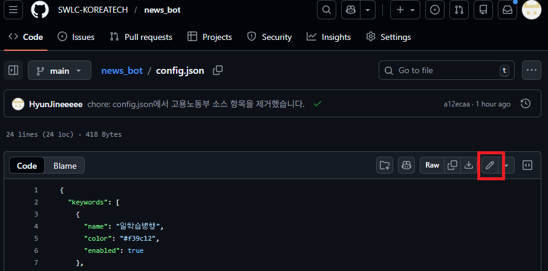
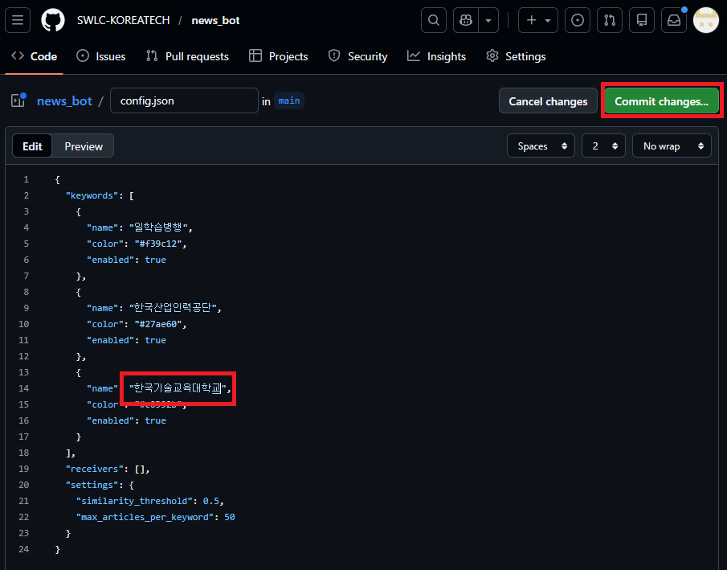

# 🤖 전담자를 위한 AI 뉴스 브리핑 봇(News Bot)

**"매일 아침, 쏟아지는 뉴스 속에서 우리 센터의 관심 이슈만 쏙쏙 골라드립니다."**

본 프로젝트는 공동훈련센터 전담자분들이 매일 수십 개의 기사를 직접 찾아보지 않고도 일학습병행 및 관련 기업의 소식을 전달받을 수 있도록 개발되었습니다. 설정한 키워드에 맞는 최신 뉴스를 AI(Gemini)가 분석하여, 매일 아침 여러분의 메일함으로 깔끔하게 전달합니다.

---

## 🚀 3분 만에 시작하기 (Setup Guide)

### 0단계: 사전 준비 (Preparation)

본 도구를 사용하기 위해 아래 3가지 준비물이 반드시 필요합니다.

#### 1. GitHub 계정 준비 (회원가입)

코드 관리와 자동 실행(Actions)을 위해 GitHub 계정이 필요합니다.

- 계정이 없다면 [GitHub.com](https://github.com/join)에서 회원가입을 완료해 주세요.

#### 2. 메일 발송용 Gmail 계정 및 앱 비밀번호 설정

보안을 위해 평소 사용하는 계정보다는 발송 전용 Gmail 계정(개인용 권장)을 새로 만드시는 것을 권장합니다.

1. [구글 계정 관리 &gt; 보안](https://myaccount.google.com/security) 페이지로 이동합니다.
2. **[2단계 인증]**을 활성화합니다. (필수 조건)
3. 검색창에 "앱 비밀번호"를 검색하거나 [이 링크](https://myaccount.google.com/apppasswords)로 직접 이동합니다.
4. 앱 이름에 `뉴스 봇` 등을 입력하고 **[만들기]**를 클릭합니다.
5. 생성된 **16자리 비밀번호**(`aaaa bbbb cccc dddd` 형태)를 복사해둡니다. (나중에 `EMAIL_PASSWORD` 비밀 값으로 사용 — *일반 로그인 비밀번호와는 다릅니다!*)

#### 3. 구글 AI 스튜디오 (Gemini API 키) 발급

뉴스 요약의 '두뇌' 역할을 하는 키를 발급받습니다.

1. [Google AI Studio](https://aistudio.google.com/)에 접속하여 구글 계정으로 로그인합니다.
2. 좌측 상단의 **[Get API key]** 버튼을 클릭합니다.
3. **[Create API key in new project]**를 눌러 키를 생성합니다.
4. 생성된 키(AIza...)를 따로 복사해둡니다. (나중에 `GEMINI_API_KEY` 비밀 값으로 사용)
5. **[중요 - 필수 확인]** API 키가 정상 작동하려면 Google Cloud 프로젝트에 **결제 수단(Billing)**이 등록되어 있어야 합니다.
   - **결제 계정 설정 방법:**
     1. [Google Cloud Console 결제 페이지](https://console.cloud.google.com/billing)에 접속합니다.
     2. **[결제 계정 만들기]** 또는 기존 계정을 선택합니다.
     3. 신용카드 또는 체크카드를 결제 수단으로 등록합니다. (최초 등록 시 프로젝트 확인용으로 약 1달러가 가결제될 수 있으나 곧 취소됩니다.)
     4. AI Studio에서 사용 중인 프로젝트(예: `Generative Language Client`)를 해당 결제 계정에 연결합니다. (좌측 메뉴 **[결제 관리]** > **[내 프로젝트]** 탭에서 연결 상태 확인 가능)
     5. 요금제 중 'Pay-as-you-go'(사용량 기준 과금)**를 선택해야 API 제한 없이 원활하게 작동합니다. (무료 한도 내에서는 실제 요금이 부과되지 않으므로 안심하세요.)

#### 💡 [필독] 무료 vs 유료(결제 연결) 요금제 선택 가이드

사용 환경에 따라 요금제 연결 여부를 선택하세요. **보안과 안정성을 위해 '유료(결제 연결)' 모드를 강력히 권장**합니다.

| 구분                  | 무료 티어 (결제 미연결)                     | **Pay-as-you-go (결제 연결)**            |
| :-------------------- | :------------------------------------------ | :--------------------------------------------- |
| **안정성**      | 사용자가 몰릴 때 429 에러(차단) 빈번        | **항상 최우선 순위로 안정적 작동**       |
| **데이터 보안** | 입력 데이터가 **구글 학습에 사용됨** | **데이터 보안 유지 (학습에 사용 안 됨)** |
| **속도 제한**   | 분당 15회 (지연 발생 가능)                  | 분당 2,000회 (매우 빠름)                       |
| **비용**        | 0원                                         | **무료 할당량 내 0원 (사실상 무료)**     |

> [!TIP]
> **왜 '유료(결제 연결)'를 권장하나요?**
> 결제 수단만 등록해두면, 현재 뉴스 봇의 규모(하루 수십 건)로는 **실제 비용이 청구되지 않으면서도(0원)**, 훨씬 빠르고 데이터 보안이 철저한 유료 급 서비스를 안정적으로 이용할 수 있기 때문입니다.

### 1단계: 나만의 비공개 저장소 만들기

보안을 위해 아래 방법을 통해 본인의 계정으로 코드를 가져오세요.

1. 이 저장소 상단의 **[Use this template]** 버튼을 클릭합니다.
   
2. [Create a new repository]를 선택합니다.
3. 저장소 설정에서 Repository name을 입력하고 반드시 [Private]을 체크하세요. (공개 시 이메일 정보가 노출될 수 있습니다.)

### 2단계: 필수 열쇠(Secrets) 등록하기

GitHub 저장소의 **Settings** > **Secrets and variables** > **Actions** 메뉴에서 **[New repository secret]** 버튼을 클릭하여 아래 4가지 값을 등록합니다.

| Name(이름변경 금지) | 설명                                                        | Secret(예시)                               |
| ------------------- | ----------------------------------------------------------- | ------------------------------------------ |
| `GEMINI_API_KEY`  | Google AI Studio에서 발급받은 API 키**(0단계 3번 참조)**   | AIzaSy~                                    |
| `EMAIL_USER`      | 알림을 보낼 Gmail 계정 주소**(0단계 2번 참조)**            | sample3@example.com                        |
| `EMAIL_PASSWORD`  | 이메일 발송용 계정의 Gmail 앱 비밀번호**(0단계 2번 참조)** | aaaa bbbb cccc dddd                        |
| `EMAIL_RECEIVER`  | 뉴스를 받을 수신자 이메일**(쉼표로 여러 명 가능)**         | sample@example.com, sample2@example.com, ~ |

---

## 🧪 제대로 설정됐는지 테스트해보기 (Manual Test)

설정을 마치셨다면, 내일까지 기다릴 필요 없이 즉시 작동 여부를 확인할 수 있습니다.

1. GitHub 저장소 상단의 **[Actions]** 탭을 클릭합니다.
2. 왼쪽 목록에서 **[Daily News]** 워크플로우를 선택합니다.
3. 우측의 **[Run workflow]** 버튼을 누르고, 다시 한 번 초록색 **[Run workflow]**를 클릭합니다.
4. 잠시 후 목록에 작업이 생성되며, 성공적으로 완료되면 설정한 이메일로 첫 번째 뉴스 리포트가 도착합니다!

   

---

## ⚙️ 커스터마이징 가이드

### 1. 검색 키워드 및 필터 수정

1. `config.json` 파일을 수정하여 원하는 정보를 골라받으세요.

   
2. 연필모양 버튼 클릭

   
3. 키워드 수정 및 추가 후 **[Commit changes]** 버튼 클릭

   - **키워드**: 우리 센터가 관리하는 기업명이나 관심 주제를 추가하세요.
   - **팁**: 기업명 입력 시 `(주)`와 같은 수식어는 빼고 입력하는 것이 검색 정확도가 높습니다.

   

### 2. 실행 시간(스케줄) 변경하기

뉴스 봇은 기본적으로 매일 아침(한국 시간 기준)에 실행됩니다. 시간을 바꾸고 싶다면:

1. `.github/workflows/daily.yml` 파일을 엽니다.
2. `cron: '0 23 * * *'` 부분을 수정하세요. (세계 표준시 UTC 기준입니다. 한국 시간은 +9시간을 더해야 합니다.)
   - 예: 한국 시간 아침 8시 실행 → `'0 23 * * *'` (전날 밤 11시)
   - 예: 한국 시간 낮 12시 실행 → `'0 3 * * *'`

---

## 🔒 보안 및 주의사항

- **비공개 권장**: 이 저장소는 여러분의 소중한 키워드와 이메일 정보를 담고 있습니다. 절대 **Public**으로 전환하지 마세요.
- **API 할당량**: Gemini 무료 티어의 속도 제한을 준수하기 위해 기사당 약 6초의 지연 시간이 포함되어 있습니다. 너무 많은 키워드(50개 이상)를 넣으면 실행 시간이 길어질 수 있습니다.

---

## 📄 기술 스택 및 오픈 소스

- **AI**: Google Gemini 2.0 Flash
- **Engine**: Python, GitHub Actions
- **Deduplication**: Semantic Word-Set Analysis (자체 고도화 중복 제거)
